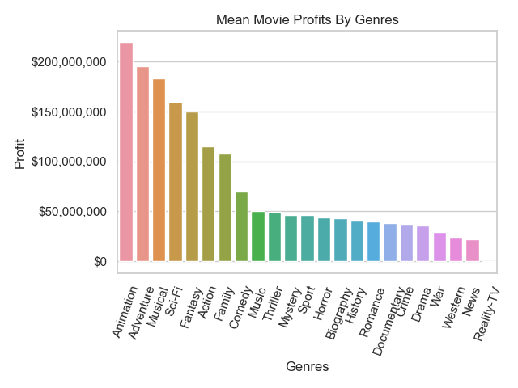
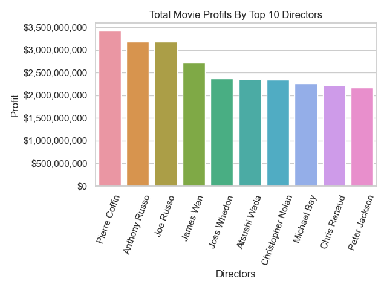
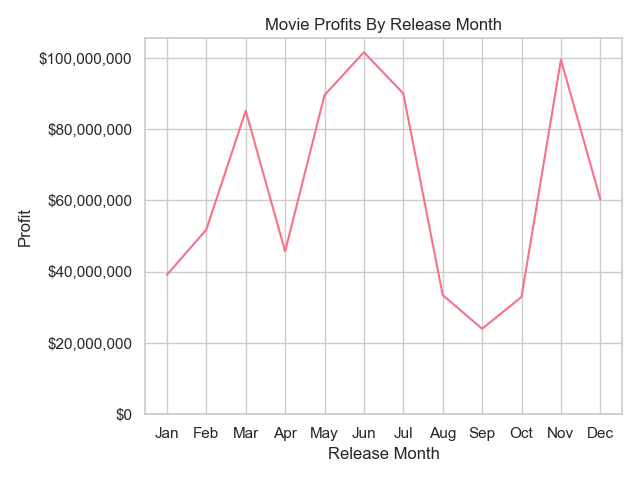

<center></center>

# Movie Studio Analysis
Author: [Scarlett Valentin](https://www.linkedin.com/in/scarlett-valentin/)

# Business Understanding
Our company has decided to create a **new movie studio**. This is a new venture for the company and our first introduction to the film industry. I will be exploring what types of films are currently doing the best at the box office. My focus will be to make suggestions for the first film we will produce to make it as successful as possible. I will be focusing on **movie profit** to determine the success of a movie, which will be calculated by deducting the movie budget from the worldwide gross.

In order to help decide what types of films to create, I investigate the following 3 business questions:
1. What **genre** movie would produce the greatest profits?
2. What **director** would produce the greatest profits?
3. Which **release month** would produce the greatest profits?

# Data Understanding
I use 2 datasets in this notebook.
1. **tn.movie_budgets.csv.gz**: This is a datset from [The Numbers](https://www.the-numbers.com/) containing release date, production budget, domestic gross and worldwide gross for 5,782 movies. I use this dataset to determine the most profitable movies and to analyze the release month of the movies.
2. **im.db**: This is a database from [IMDB](https://www.IMDB.com) containing 8 tables. I chose 3 tables to use - *movie_basics*, *directors*, and *persons*.  `movie_basics` has basic movie information for 146,144 movies. `directors` has 140,417 entries of movie id's matched to person id's. `persons` has 606,648 people related to the movies with their birth year, death year, and primary professions. I use this dataset to determine the director and genre that will result in the most profitable movie.

## Data Preparation
After completing an overview of each of the datasets, I clean the data to prepare it for analysis. I then use SQL Query to merge the two cleaned dataframes.
Cleaning The Numbers:
1. I must convert columns `production_budget`,  `domestic_gross` and `worldwide_gross` to type *int* in order to use aggregate functions.
2. I then create a `profit` column, which takes the `worldwide_gross` column minus the `production_budget` column. This will help me determine success of a movie.
3. Then I create a `release_month` column that takes just the month in the `release_date` column. This will help me determine the most successful month to release a movie.

Cleaning IMDB:
In order to clean the IMDB data, I join the three tables - *movie_basics*, *directors*, and *persons* - into one table and save it as `imdb_df`. Here are the steps I took to join them:
- Take primary_title from *movie_basics* and label it as **Movie_Title**.
- Take genres from *movie_basics*, add a space after each comma, and label it as **Genres**.
- Take primary_name from *persons*, list all distinct names, separate with a space and comma, and label it as **Directors**
- Connect *movie_basics* table to *directors* table using movie_id
- Connect *directors* table to *persons* table using person_id
- Group the data by *movie_id*

# Exploratory Data Analysis
### Movie Profits By *Genre*
I grouped the data by genre and found the mean movie profits for each genre. According to the following barplot, **Animation movies** have the **greatest mean profit** at $219,399,378.



### Movie Profits By *Director*
I grouped the data by director and found the sum of movie profits for each director. I then created a visualization of the top 10 directors determined by greatest movie profits. According to the following barplot, **Pierre Coffin** has the **greatest profit** at $3,419,745,331.



### Movie Profits By *Release Month*
I grouped the data by release month and found the mean movie profits for each release month. According to the following lineplot, **June** has the **greatest mean profit** at $101,567,182.



# Conclusion

## Limitations
There are various limitations in this analysis.

1. The **datasets** had to be **greatly cut down**. IMDB started with over 140,000 movies, but since there was not profit information for this data, our final dataset ended up being just 3,727 movies to make sure each movie had profit, genre and director information.
2. There are many factors that contribute to the success of a movie and the profits earned. This analysis solely considers genre, director, and release month. While I focus on these factors, a number of **other factors can be contributing to the profit numbers**.

## Recommendations
This analysis has led me to conclude the following three recommendations:

1. The **genre** of the first movie produced should be **animation**. Animation movies return the greatest profits at an average of $219,399,378.
   
2. The **director** of the first movie produced should be **Pierre Coffin**. He has returned the greatest profits at $3,419,745,331.
   
3. The **release month** of the first movie produced should be **June**. This month returns the greatest profits at an average of $101,567,182.

## Next Steps
Additional analysis could further optimize our profits for the acquisition of a new movie studio. I would like to investigate the following factors 
1. Analyze **budgets against profits** to determine a sweet spot for the budget for the first film. Consider costs to make film, marketing costs, and cast and staff salaries.
2. Consider the profit opportunities between **theater releases** and **streaming services**. Should this first movie be released in theaters, over streaming services, or both?
3. Determine an appropriate **runtime length** of the movie that would contribute to the success of the film. We do not want a film that is too short or too long. What runtime lengths are most successful?


# For More Information
See the full analysis in the [Jupyter Notebook](/notebook.ipynb/) or review this [presentation](/presentation.pdf/). <br>
For questions, please feel free to contact me on [LinkedIn](https://www.linkedin.com/in/scarlett-valentin/). 


# Repository Structure


```

├── images
├── README.md
├── notebook.ipynb
└── presentation.pdf
```
